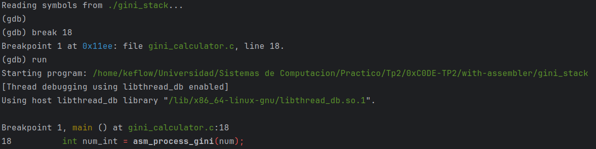
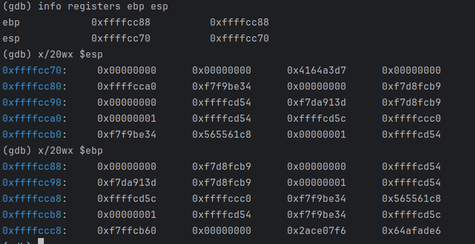
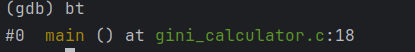
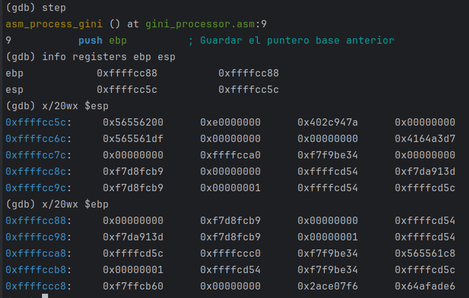
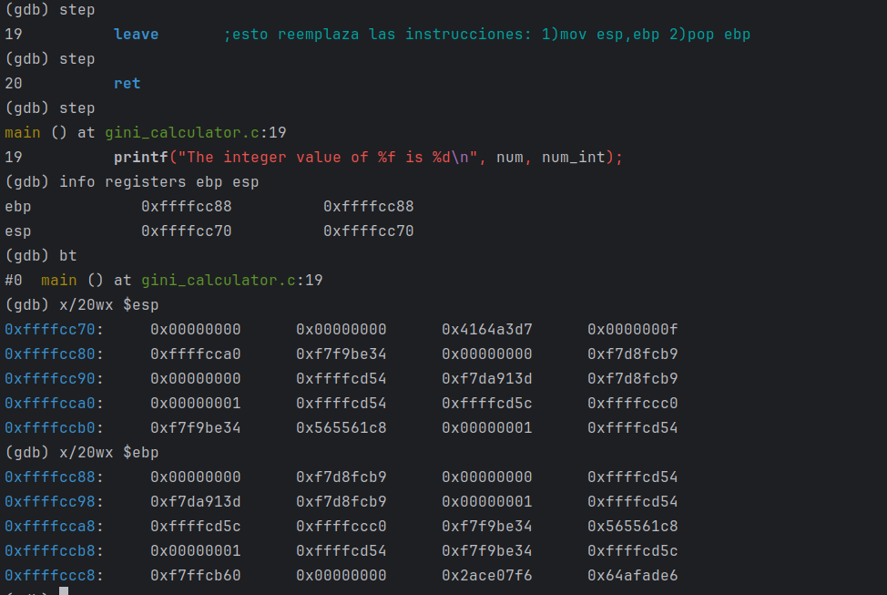
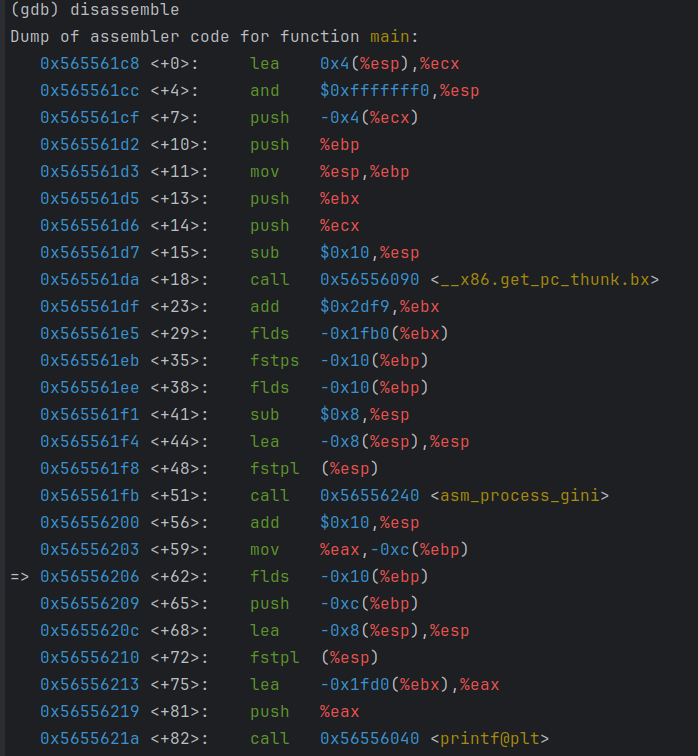
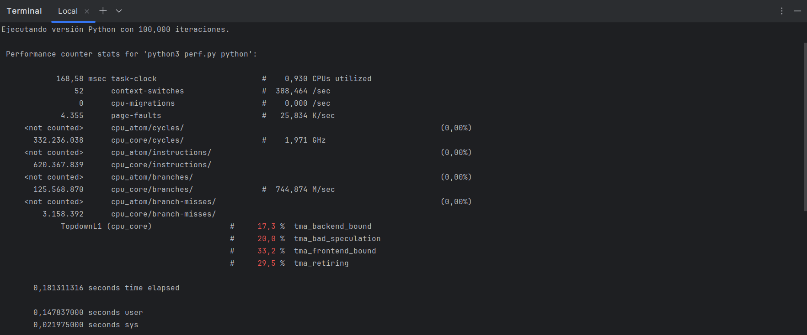

### Desarrollo
Los pasos para compilar la primera parte son:
``` 
gcc -shared -o libgini.so -fPIC gini_calculator.c
```
En cuanto el comando:
- **-shared:** le indica al compilador que cree una libreria compartida
- **-o libgini.so:** Especifica el nombre del archivo de salida (esto no es necesario)
- **-fPIC:** genera "Position Independent Code" que es necesario para una biblioteca compartida.

Esto genera un fichero tipo .so que es el que es capaz de utilizar python.

Para ejecutar el programa, primero se debe acceder a la carpeta without-assembler y ejecutar el archivo  main.py.

-------------------------------
En cuanto a la segunda parte, primero se deben compilar los archivos de assembler y C, para luego linkearlos y crear una libreria compartida de la misma manera que se hizo en la priemera parte:

``` 
nasm -f elf32 -g -F dwarf gini_processor.asm
gcc -m32 -c -fpic gini_calculator.c
gcc -m32 -g -shared gini_calculator.o gini_proccesor_asm.o -o libgini.so
```

Debido a que existe una incompatibilidad entre las librerias creadas con 32 bits(como la que acabamos de crear) y Python de 64 bits. 

Para solucionar esto, agregamos la libreria de msl-loadlib con la cual podemos crear un servidor y un cliente. Esto hace posible la comunicacion entre librerias de 32 bits y 64 bits.

------------------------
Para poder depurar el proyecto y poder observar el estado de la pila, debemos hacer lo siguiente:

``` 
nasm -f elf32 -g -F dwarf gini_processor.asm
gcc -g -o gini gini_calculator.c gini_processor.o -m32
gdb ./gini
```

Luego de esto, se debe poner un breakpoint en la linea en la que se llama a la función de assembler.

``` 
break 17
run 
```


Ahora estamos en la linea en la cual todavia no se llamó a la función de assembler, en esta posicion podemos ver el estado de los registros mas importantes **ebp esp**. 

``` 
info registers ebp esp
```

Despues de esto, podemos ejecutar un comando que nos muestra una cantidad de espacios de memoria y la informacion que se almacena en eso. Lo que mas nos interesa ver en este momento es el estado de **ESP**

``` 
x/20wx $esp
x/20wx $ebp
```



Despues podemos ver el stack frame que se está ejecutando:

``` bash
bt
```
Como estamos ejecutando esto antes de llamar a la funcion, solo veremos en el stack a main.




Luego de ver todo esto, podemos hacer un **Step** en el momento al que se llama la funcion de assembler y comparamos los valores guardados en el registro nuevamente:

``` 
info registers ebp esp eip
x/20wx $esp
x/20wx $ebp
x/20wx $eip
bt
```

En este caso nos detuvimos en la linea antes de guardar el valor de **ebp** dentro de pila, ya que la convención de llamada nos dice esto.



Luego de esto, avanzamos en el codigo y vemos como evolucionaron los registros involucrados, y además como actualmente se encuentra el stack frame.



Podemos observar claramente que ahora los registros cambiaron de valor y en especial el stack frame ahora agrega a asm_process_gini


Luego avanzamos en la ejecución al momento de salir de la función de assembler y verificamos nuevamente los registros, sabemos que el valor de EBP debe volver a ser el de antes de llamar a la funcion de assembler.



Para finalizar sabemos que el codigo realizado en C debido al compilador se crea en assembler, y gracias a un comando del GDB podemos observar el programa de C convertido a Assembler.




