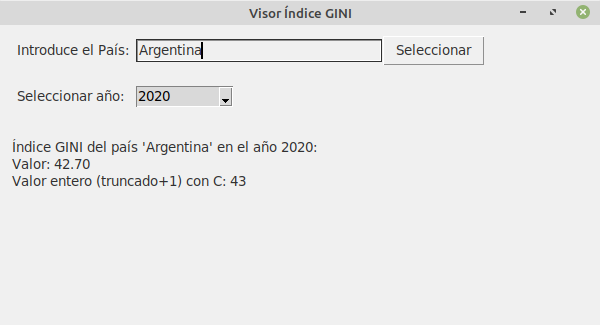
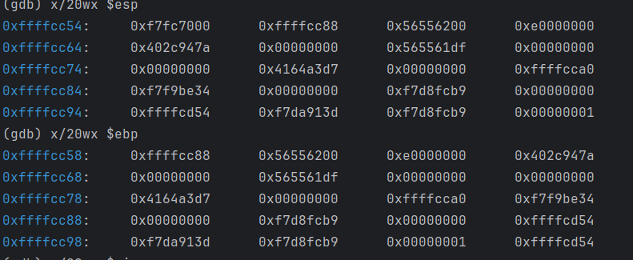
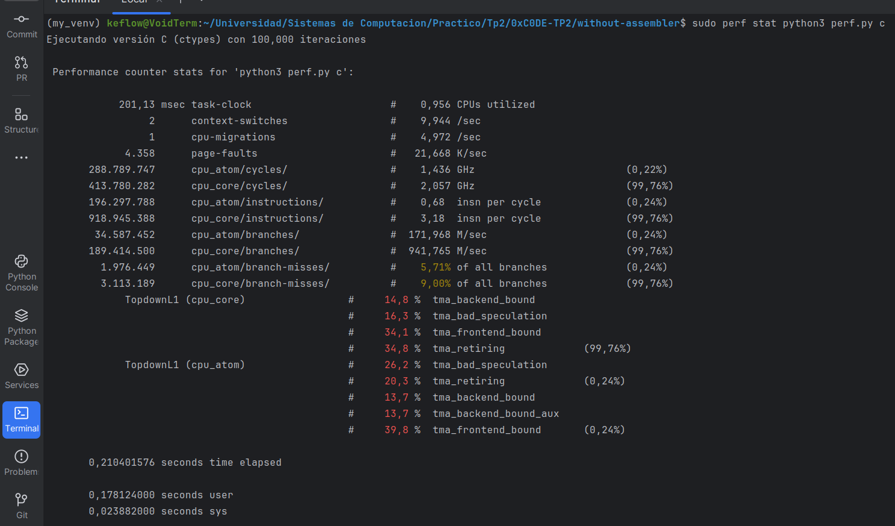
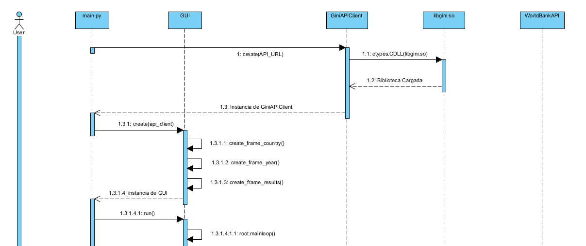
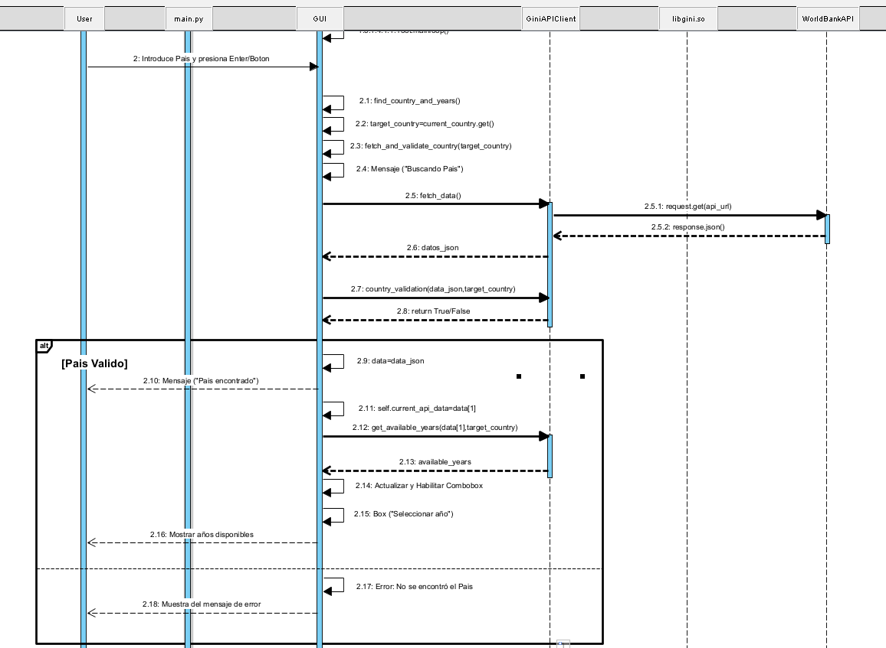
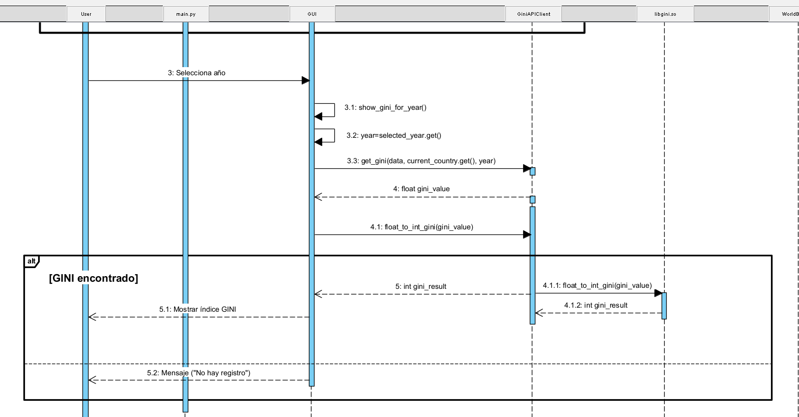

# 0xC0DE - Sistemas de compuación TP2

--------------------------------------

## Índice


- [Introducción](#introducción)
- [Desarrollo](#desarrollo)
	- [Aplicación con C](#calculadora-gini-con-c)
	- [Aplicación con Assembler](#calculadora-gini-con-assembler)
	- [Depuración](#depuración)
	- [Comparación Python vs. C](#comparación-de-performace-c-vs.-python)
- [Conclusión](#conclusión)
- [Anexos](#anexo:-diagramas)

------------------------------------------

## Introducción

Cuando se desarrollan aplicaciones grandes es común que se introduzcan problemas de rendimiento al usar lenguajes de alto nivel, pero alta complejidad para el desarrollo si se utilizan lenguajes de bajo nivel. Por ello es común que se separe el software en capas, por ejemplo, un lenguaje como python puede aprovechar la velocidad de C o C++ para realizar cálculos complejos, que a su vez pueden aprovechar el acceso directo al hardware de Assembler.

Para poder comunicarse entre sí los lenguajes utilizan convenciones de llamadas.

En este trabajo realizaremos un programa que aproveche estos 3 lenguajes (Python, C y Assembler) para realizar un cálculo en un principio simple, pero que permitirá mostrar como se pueden comunicar los distintos lenguajes.

## Desarrollo

### Calculadora GINI con C

En esta primer parte contiene lo siguiente:

- GUI desarrollada en python.
- Código python para realizar solicitudes REST para obtener índices GINI.
- Librería dinámica en C que redondea los valores y les suma uno.

El proyecto se encuentra en la carpeta *without_assembler*, desde este fichero los pasos para compilar esta parte son:

``` 
gcc -shared -o libgini.so -fPIC gini_calculator.c
```

Donde:
- **-shared:** le indica al compilador que cree una libreria compartida
- **-o libgini.so:** Especifica el nombre del archivo de salida (esto es necesario ya que el código en python espera un nombre específico para la librería)
- **-fPIC:** genera "Position Independent Code" que es necesario para una biblioteca compartida.

Esto genera un fichero tipo .so que es el que es capaz de utilizar python.

Luego para ejecutar:

```
python3 main.py
```



El código de python utiliza la librería *ctypes* para acceder a la librería dinámica en C. Para hacerlo se crea un objeto que accede a la librería y se declaran funciones de python que otorguen acceso a las funciones de C. Esto se puede observar en el archivo *server_interface.py*, donde se observa en el método `__init__` como se carga la librería dinámica y se declaran los tipos de los argumentos y el valor de retorno de su función.

```python
self.gini_lib = ctypes.CDLL("./libgini.so")
self.gini_lib.float_to_int_gini.argtypes = [ctypes.c_double]
self.gini_lib.float_to_int_gini.restype = ctypes.c_int
```

Luego el acceso a la librería se hace a travéz del método:

```python
def float_to_int_gini(self, gini_value):
	return self.gini_lib.float_to_int_gini(gini_value)
```

------------------------
### Calculadora GINI con assembler

En cuanto a la segunda parte, el código antes realizado en C será realizado en Assembler, con el código en C siendo solo un puente entre python y Assembler. En el case de C no es necesario utilizar una librería extra para acceder al código Assembler, pero desde dicho código es necesario tener ciertas precauciones, ya que cuando C llama a una función en Assembler guarda automáticamente en el stack los valores de los argumentos (Iniciando por el que esté más a la derecha al llamar a la función) y la dirección de retorno. El código de Assembler no debe perder estos valores, por lo que la convención dice que inicialmente se guarde el valor previo del registro **ebp** en el stack, y luego se guarde en **ebp** el valor de **esp** que es el puntero a la pila, de modo que de allí en adelante será posible acceder a la dirección de retorno sumando 4 a ebp, y a los argumentos sumando 8, 12, 16, etc.

El código de esta parte se encuentra en el directorio *with_assembler*. Para compilar los archivos de Assembler y C, y linkearlos para crear una librería compartida de la misma manera que se hizo en la primera parte se utilizan los siguientes comandos:

``` 
nasm -f elf32 -g -F dwarf gini_processor.asm
gcc -m32 -c -fpic gini_calculator.c
gcc -m32 -g -shared gini_calculator.o gini_processor.o -o libgini.so
```

Nótese que para compilar el objeto desde el código Assembler se utiliza el comando **nasm**, mientras que a gcc se le agrega la bandera:

- **-m32** Esta es una "opción dependiente del hardware", en el caso de sistemas *i386 and x86-64* está opción genera código para un ambiente de 32-bits, lo que es necesario para compatibilidad con el código compilado por nasm.

Debido a que existe una incompatibilidad entre las librerías creadas con 32 bits (como la que acabamos de crear) y Python de 64 bits agregamos al código de Python la librería de msl-loadlib con la cual podemos crear un servidor compatible con 32 bits y un cliente en 64 bits. Esto hace posible el uso de librerías de 32 bits desde el servidor, que se comunica con el cliente vía IPC.

nuevamente podemos ejecutar el proyecto una vez compilado con:

```
python3 main.py
```

------------------------

### Depuración

Para poder depurar el proyecto y poder observar el estado de la pila, debemos compilarlo con las opción de gcc **-g** que permite a gdb hacer debugging del proyecto, y linkearlo con el objeto Assembler, una vez hecho podemos iniciar el debugging con gdb como se muestra a continuación:

```
nasm -f elf32 -g -F dwarf gini_processor.asm
gcc -g -o gini gini_calculator.c gini_processor.o -m32
gdb -q ./gini
```

La opción -q de gb simplemente hace que no se imprima la presentación y el mensaje de copyright de gdb, por lo que no es estrictamente necesaria. Luego de esto, se debe poner un breakpoint en la linea en la que se llama a la función de Assembler (linea 18 de gini_calculator.c).

``` 
break 18
run 
```


Ahora estamos en la linea en la cual todavía no se llamó a la función de assembler, en esta posicion podemos ver el estado de los registros mas importantes **ebp esp**. 

``` 
info registers ebp esp
```

Después de esto, podemos ejecutar un comando que nos muestra una cantidad de espacios de memoria y la información que se almacena en eso. Lo que mas nos interesa ver en este momento es el estado de **esp**

``` 
x/20wx $esp
x/20wx $ebp
```


Podemos ver el stack frame que se está ejecutando con el comando **bt**. Como estamos ejecutando esto antes de llamar a la función, solo veremos en el stack a main.


Luego de ver todo esto, podemos hacer un **Step** en el momento al que se llama la función de assembler y comparamos los valores guardados en el registro nuevamente:

``` 
info registers ebp esp eip
x/20wx $esp
x/20wx $ebp
x/20wx $eip
bt
```

En este caso nos detuvimos en la linea antes de guardar el valor de **ebp** dentro de pila.


Podemos observar que el registro **ebp** se mantiene inalterado mientras que **esp** fue modificado ya que la llamada a la función introduce los argumentos y la dirección de retorno a la pila. Esto justifica el decremento de 8 bytes (un argumento más la dirección de retorno) además 4 bytes extra son por la instrucción **push ebp**, pero el real es de 20 bytes, probablemente por otras tareas realizadas por C antes de efectuar realmente la llamada.

Luego de esto, avanzamos en el código y vemos como evolucionaron los registros involucrados, y además como actualmente se encuentra el stack frame.


Podemos observar claramente que ahora los registros cambiaron de valor y en especial el stack frame ahora agrega a asm_process_gini


Luego avanzamos en la ejecución al momento de salir de la función de assembler y verificamos nuevamente los registros, sabemos que el valor de EBP debe volver a ser el de antes de llamar a la función de assembler.



Para finalizar sabemos que el código realizado en C debido al compilador se crea en assembler, y gracias a un comando del GDB podemos observar el programa de C convertido a Assembler.


-----------------

### Comparación de performance C vs. Python

Para comparar los rendimientos de la aplicación que hace uso de la función creada con C y otra que utiliza una función que hace lo mismo en Python, utilizamos la herramienta perf que es un perfilador que funciona por **inyección de código**, esto significa que el programa se ejecuta en un modo especial donde se generan interrupciones del sistema registrando y verificando la función o método que se este ejecutando actualmente.

Para realizar esto tenemos que ejecutar el siguiente comando:

```
sudo perf stat python3 perf.py python
sudo perf stat python3 perf.py c
```

Esto nos muestra lo siguiente, primero verificamos los tiempos de simulación de la función de python y luego la de C:




Como se puede observar, ocurre algo inesperado ya que la función realizada con python se esta ejecutando mas rápido que la de C lo cual en principio no debería pasar. 

Sin embargo luego de investigar, concluimos que esto ocurra debido al overhead que existe llamando a Ctypes, lo cual por detrás utiliza muchas librerías y métodos mas. En cambio
con python esto no ocurre, ya que es mucho mas directo. 

Ademas, el trabajo matemático que debe hacer C es casi nulo por lo que no se justifica utilizarlo siendo que python puede realizarlo de forma directa.

--------------------------------------

## Conclusión

La conexión entre programas de alto nivel y librerías de bajo nivel tiene claramente el potencial de mejorar la performance de una aplicación, manteniendo la simplicidad de los lenguajes de alto nivel para el desarrollo de las partes más complejas como puede ser una GUI. Aún así también queda claro tras realizar la comparación de la parte 4 que esto no siempre está justificado, como desarrolladores debemos ser consientes de el overhead que se introduce al comunicar los lenguajes, no solo el observado por Python para conectar con la librería en C, sino también el pequeño pero existente overhead que implica la convención de llamadas de C a Assembler (Ingresar los argumentos y dirección de retorno en el stack, y manipular dicho stack en Assembler), por su puesto este segundo caso es más similar a el overhead de llamar a una función de C, pero la conclusión es la misma, la tarea realizada por el lenguaje de bajo nivel debe ser lo suficientemente compleja para justificar su uso.

--------------------------------------

## Anexo: Diagramas

**Diagramas de flujo, aplicación de las partes 1 y 2**







